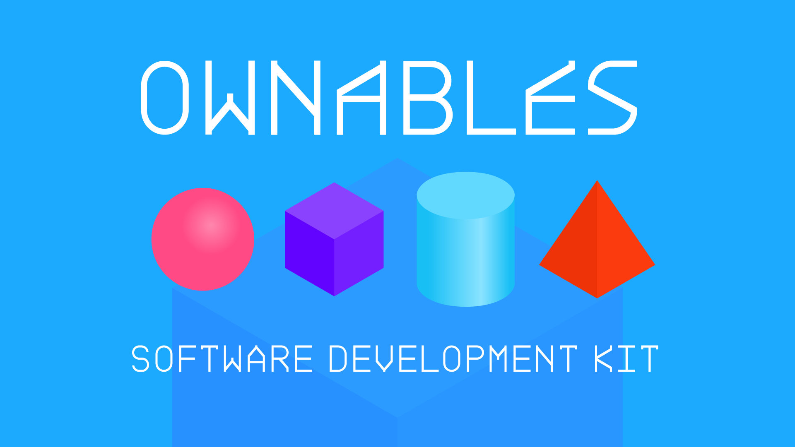

# OWNABLES SDK

<figure><figcaption></figcaption></figure>

Ownables are CosmWasm smart contracts that define ownership. Instead of running on a blockchain node, Ownables run directly in a wallet using the LTO Network [private layer](../../protocol/private/).

Looking into [CosmWasm](https://cosmwasm.com/) smart contracts and [WebAssembly](https://webassembly.org/) is a great idea to grasp the fundamentals upon which Ownables are designed.




[prerequisites.md](prerequisites.md)



[setup.md](setup.md)

