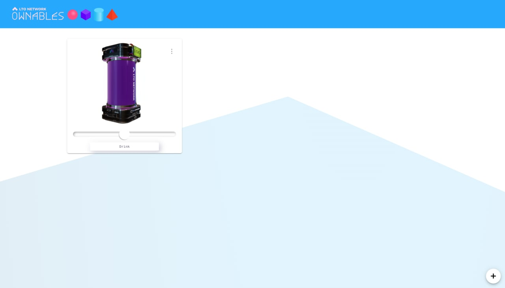

# Setup

### Cloning the base repository

First, you will need to clone the base `ownables-sdk` [repository](https://github.com/ltonetwork/ownable-demo) and save it under your preferred location.

```shell-session
$ git clone git@github.com:ltonetwork/ownable-sdk.git
$ cd ownable-sdk
```

Open it in your preferred editor and proceed to the next section.

### Starting the demo wallet

First, navigate to the wallet directory and install the dependencies:

```shell-session
$ cd www/
$ npm i
```

We can now start the wallet:

```shell-session
$ npm run start
```

Once that is done, navigate to [http://localhost:8080/](http://localhost:8080/) and you should see an empty wallet that is ready to import OWNABLES packages.

<figure><figcaption><p>Empty wallet</p></figcaption></figure>


### Building the OWNABLE

Now that the wallet is running, we need some OWNABLES packages that we can import.

There are a few handy commands for that.

The `ownables:build` script, which takes a `--package` parameter that specifies which OWNABLE should be packaged. The potion OWNABLE is built by running:

```shell-session
$ npm run ownables:build --package=potion
```

Running this will produce a zip file containing the OWNABLE under `ownables` folder.

Now we can go back to our wallet and click the :heavy\_plus\_sign: icon at the bottom right. This will open an action menu in which we can choose to import a new OWNABLE from a file and select the zipped package from the previous step.

After importing the potion OWNABLE package, there will be another option in the action menu named **potion**, clicking on which will issue the OWNABLE.

<figure><figcaption><p>Wallet with an Ownable</p></figcaption></figure>

_Success!_ The issued OWNABLE will be visible in your wallet.

#### Building all OWNABLES

In case you want to build all OWNABLES in your project at once, run:

```shell-session
$ npm run ownables:build-all
```

It will simply run the previous script in every directory under `/ownables` .



To get more insight on how to build your own custom OWNABLES read about the [OWNABLE Architecture](../ownables-architecture/smart-contract.md).

