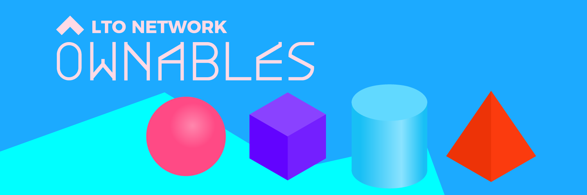

# What are Ownables?

<figure><figcaption></figcaption></figure>

Ownables are digital assets that live in your wallet. To understand the power of Ownables, we first need to look at how NFTs and blockchain wallets work.

A blockchain wallet doesn’t hold NFTs. It only holds key pairs which are used for cryptographic signatures. Each key pair is associated with a blockchain address. For an NFT, an on-chain record is kept connecting a unique number with the owner’s address. Transferring or interacting with the NFT requires the owner to sign with its private key.

Ownables flip this concept around. **Everything concerning the Ownable is stored in your wallet.** Not only images or media but also the smart contract and event chain. We have also made it possible to embed whole applications, opening up a world of endless possibilities.

What makes LTO Network unique is that it’s a hybrid blockchain with a public and private layer. The private layer allows holding info privately, delegating consensus to the public layer. Ownables live on the [private](../protocol/private/ "mention").

<figure><figcaption></figcaption></figure>

Since there are no gas fees and no costs for the size of the contracts, smart contracts on the private layer may be larger and more complex than typical blockchain contracts.

* These smart contracts aren’t run on a node but are executed directly in your wallet.
* Ownable contracts are never published on-chain. They're obtained using a [bridge](ownables-bridge.md).
* Smart contracts are compiled into WebAssembly using the [CosmWasm](https://cosmwasm.com/) standard library.&#x20;
* They run in a sandboxed and deterministic runtime environment.

Smart Contracts are typically written in Rust, but any WebAssembly program can function as a smart contract with only a few constraints. The main constraint is that the contract must be deterministic. That means that the state of the contract can only be changed through events that have been added to the event chain. Information about ownership is part of the state of the contract.


Want to explore Ownables and create your own? [Get started with Ownables SDK.](ownables-sdk/)

