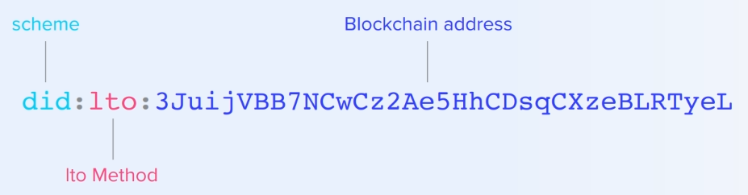

# Decentralized identifiers \(DID\)

DIDs are unique universally resolvable identifiers. A DID represents a _subject_, which can be a person, but also an organization, object, document, etc. There is no central register that registers all DIDs. Instead, there a DID has a method that indicates how it can be resolved.


Resolving a DID results in a DID document. This document contains cryptographic material that allows the _DID controller_ to prove control of the DID.


What proofing control of a DID means depends on the subject. If the DID represents a person, it allows that person to identify themselves. In case the DID represents an object, it allows a person to prove he owns that object.


DID documents do not contain other \(identifying\) information, like a name, address, etc.

## LTO Network DID method

DID with the method "**lto**" can be resolved by the LTO Network identity node.



The method-specific string is an address on the public chain. In the case of derived DIDs, it's followed by a path.

```text
lto-did = "did:lto:" lto-specific-idstring
lto-specific-string = lto-address [ lto-path ]
lto-address = 35\*( ALPHA / DIGIT )
lto-path = 1*( "/" 1*pchar )
pchar = (ALPHA / DIGIT / "-" / "." / "_" / "~" )
```

The LTO method-specific string is case-sensitive.

## Implicit identities

Any address on the LTO public chain can be represented by a DID. The DID document always contains a single verification method containing the public key of the account. This method is applicable for both authentication and assertion.

```javascript
{
  "@context": "https://www.w3.org/ns/did/v1",
  "id": "did:lto:3JugjxT51cTjWAsgnQK4SpmMqK6qua1VpXH",
  "verificationMethod": [
    {
      "id": "did:lto:3JugjxT51cTjWAsgnQK4SpmMqK6qua1VpXH#key",
      "type": "Ed25519VerificationKey2018",
      "controller": "did:lto:3JugjxT51cTjWAsgnQK4SpmMqK6qua1VpXH",
      "publicKeyBase58": "mMyJxTQuXW9bQVLmJeCrWNCSKzsEMkbZQ3xuNavj6Mk"
    }
  ],
  "authentication": [
    "did:lto:3JugjxT51cTjWAsgnQK4SpmMqK6qua1VpXH#key"
  ],
  "assertionMethod": [
    "did:lto:3JugjxT51cTjWAsgnQK4SpmMqK6qua1VpXH#key"
  ],
  "capabilityInvocation": [
    "did:lto:3JugjxT51cTjWAsgnQK4SpmMqK6qua1VpXH#key"
  ]
}
```


It's only possible to resolve a DID for accounts that have signed at least one on-chain transaction. To generate a DID document, the public key of the address needs to be known. It's not possible to determine the public key purely based on the blockchain address.


## Constructed identities

It's possible to explicitly specify verification methods for a DID document using associations. An association with the type `0x01??` specifies that the public key of the association recipient is a valid verification method for the association sender.

The two least significant bytes from a bit-set that specifies the verification relationship.

| Hex | Relationship |
| :--- | :--- |
| 0x0100 | Verification method without relationship |
| 0x0101 | Authentication |
| 0x0102 | Assertion |
| 0x0104 | Key agreement |
| 0x0108 | Capability invocation |
| 0x0110 | Capability delegation |


**Example:** To create a verification method that can be used for authentication, assertion, and key agreement, create an association with type `0x010007`.



The association recipient needs to have signed at least one on-chain transaction, so the public key of that account is indexed.


For accounts that have at least one verification method association, there is no implicit verification relationship of the indexed public key for authentication and assertions. By default, it can only be used as management key; to sign transactions for updating the DID document.


The management key is always listed as verification method with the capability invocation relationship. Adding alternative methods for capability invocation does not automatically make it possible to use those keys to sign blockchain transactions for updating the DID document.


The key relationship verification method only works type `X25519KeyAgreementKey2019`. The X25519 public key is generated from the ED25519 public key used to sign a transaction. In case the association recipient uses an alternative cryptographic algorithm, like ECDSA Secp256k1, the association is ignored.

## Derived identities

It’s not advisable to use DIDs of private identities for multiple purposes. Correlating information might allow a party to deduce information, undermining privacy.

LTO Network supports single-use DIDs in the form of derived identities using the form `{address}/derived/{secret}`.

The DID document of a derived identity is always the same DID document for the account.

```javascript
{
  "@context": "https://www.w3.org/ns/did/v1",
  "id": "did:lto:3JugjxT51cTjWAsgnQK4SpmMqK6qua1VpXH/derived/12D",
  "alsoKnownAs": [
    "did:lto:3JjgwMRYr7dn3kwejdqi3K8qXRAg6MbanVP"
  ],
  "verificationMethod": [
    {
      "id": "did:lto:3JugjxT51cTjWAsgnQK4SpmMqK6qua1VpXH#key",
      "type": "Ed25519VerificationKey2018",
      "controller": "did:lto:3JugjxT51cTjWAsgnQK4SpmMqK6qua1VpXH",
      "publicKeyBase58": "mMyJxTQuXW9bQVLmJeCrWNCSKzsEMkbZQ3xuNavj6Mk"
    }
  ],
  "authentication": [
    "did:lto:3JugjxT51cTjWAsgnQK4SpmMqK6qua1VpXH#key"
  ],
  "assertionMethod": [
    "did:lto:3JugjxT51cTjWAsgnQK4SpmMqK6qua1VpXH#key"
  ]
}
```

Derived DIDs have a blockchain address that's different from the DID of the account. This is calculated using hmac instead of normal hashing.

```text
sha256_hmac(blake2b256(ED25519_public_key), nonce)
```


The blockchain address is given as `alsoKnownAs` property. But it can't be resolved by the identity node. Derived DIDs must always include the account address and secret. The derived address should never be used directly.


