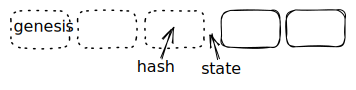

# Event chain

The private layer isn't a single blockchain. Instead, it consists of micro-ledgers that are stored locally and shared between wallets.

Normally a ledger is a hash chain of blocks, with each block containing multiple transactions. The event chain consists of individual events. Each event references the previous event, forming a hash chain.&#x20;

The first event of the chain is referred to as the **genesis event**.

## Chain id

Each event chain has a globally unique identifier.

The event chain id MUST be calculated from the public key used to sign the genesis event of the chain. The `id` is a base58 encoded value from the following data structure:

<table><thead><tr><th width="63">#</th><th width="414">Field name</th><th width="130">Type</th><th>Length</th></tr></thead><tbody><tr><td>1</td><td>Type (0x42)</td><td>Byte</td><td>1</td></tr><tr><td>2</td><td>Nonce bytes</td><td>Bytes</td><td>20</td></tr><tr><td>3</td><td>Public key hash</td><td>Bytes</td><td>20</td></tr><tr><td>4</td><td>Checksum</td><td>Bytes</td><td>4</td></tr></tbody></table>

The public key hash is the first 20 bytes of _SecureHash_ of public key bytes. _SecureHash_ is the hash function `sha256(Blake2b(data))`.

Checksum is the first 4 bytes of _SecureHash_ of the `version`, `nonce` and `hash` bytes.

The nonce bytes can be generated at random. If a nonce is specified the nonce bytes are the first 20 bytes of the `sha256` hash of the given nonce.


Older event chains use `0x41` as type instead of `0x42`. The events of these chains have a different binary schema.


### Derived id

An event chain can create derived ids. These can be used to generate unique identifiers for resources that belong to this chain. A derived id is a base58 encoded value from the following data structure:

<table><thead><tr><th width="63">#</th><th width="414">Field name</th><th width="130">Type</th><th>Length</th></tr></thead><tbody><tr><td>1</td><td>Type (0x51)</td><td>Byte</td><td>1</td></tr><tr><td>2</td><td>Nonce bytes</td><td>Bytes</td><td>20</td></tr><tr><td>3</td><td>Event id hash</td><td>Bytes</td><td>20</td></tr><tr><td>4</td><td>Checksum</td><td>Bytes</td><td>4</td></tr></tbody></table>

The event id hash is the first 20 bytes of _SecureHash_ of event id bytes.

## Hash chain

The event chain contains an array of events. Each event is hashed. The event contains the hash of the previous event, so the events form a hash chain.

### Initial hash

The `previous` field of the genesis event is a value that is unique to this event chain. This ensures that the genesis event and all subsequent events have a unique hash, even if the rest of the data is the same.

The initial hash is the `sha256` hash of the event chain id bytes.

### Events

An event can be seen as an envelope around the event data. For more details see


[event.md](event.md)


## States

For an event chain with a specific set of events, we can calculate the state.


The event hash of the last event is already a unique identifier for the event chain with a set of events. However, we need a unique value that can't be calculated on the event alone, for [rollback detection](./#rollback-detection).


### Initial state

The state of the event chain with no events is calculated purely based on the event chain id. The initial state is the `sha256` hash of the id bytes in reverse order.

```
sha256(reverse(id_bytes))
```

### Subsequent states

Each subsequent state is calculated based on the previous state, plus the event hash

```
next_state = sha256(concat(current_state, event.hash))
```

To calculate the state at a point on the chain, you'll need to loop through the events up to there.

## Event anchoring

The state and hash of the subsequent event form a pair, with the state as key and hash as value. These pairs can be anchored to the LTO public chain using the mapped anchor transaction.



### Rollback detection

The state should be used only once as the key of the mapped anchor. If it's used multiple times, this could indicate a rollback.

<figure><figcaption></figcaption></figure>

There should be no anchor with the current state as the key. If we do find that anchor on the public chain, it means that there may be additional events that we did not receive.

If the time of anchoring is important. If there are multiple anchors for the same state, and the first anchor value is not the hash of the event, it could indicate a rollback.


When determining which anchor is first, look at the block height and tx position, not the tx timestamp.



Anyone that has a copy of the event chain, can potentially anchor a transaction for the given state. This would allow a bad actor to permanently break the event chain.

Therefore it's important to disregard any anchor tx signed by parties that aren't allowed an event at that point of the chain. This logic is specific to the use case. For example; see [rollback detection for Ownables](broken-reference).


## Partial chain

A partial chain only contains a subset of the events. These are always the last events of the chain.

When converting a partial chain to JSON, the first entry of `events` is a stub. The stub contains

* The `state` of the chain at the point where it was sliced
* The `hash` of the last event that's not part of the partial chain



Removing events from an event chain creates an invalid chain and not a partial chain. The hash and state must be known to create a partial chain.

