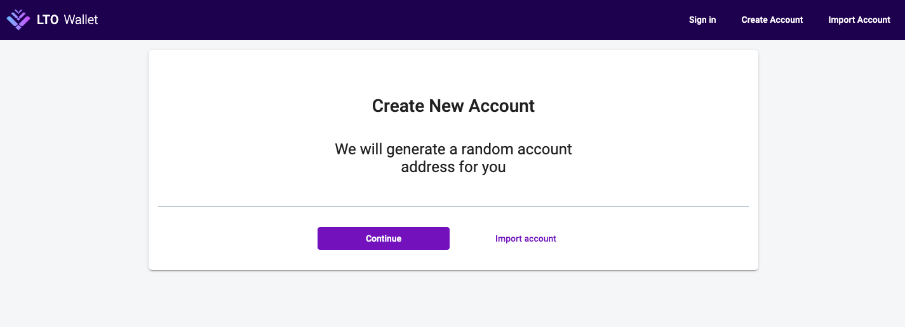
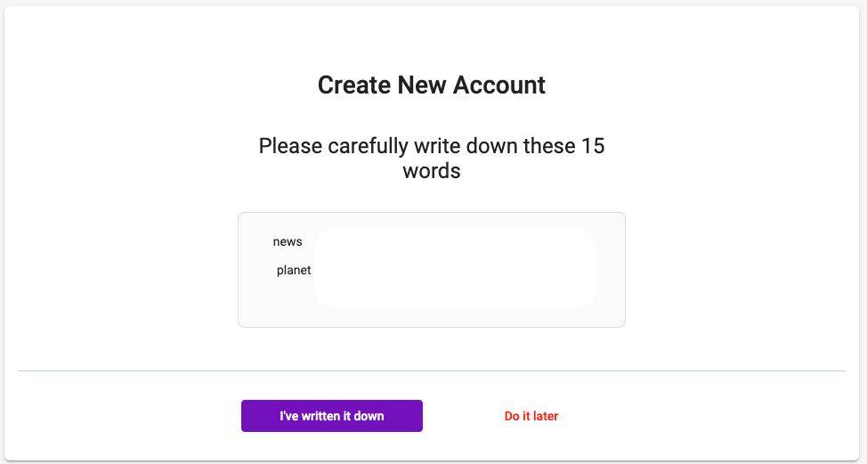
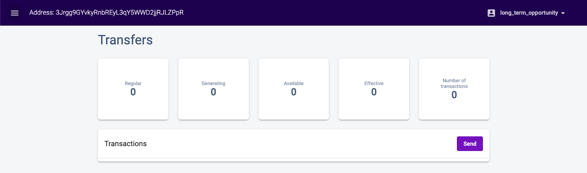

# Creating your LTO web wallet

## Creating a web wallet

The web wallet is an official vault for your LTO tokens. If don't have one already visit [https://wallet.lto.network/](https://wallet.lto.network/) and create a new account by selecting _Continue_:

Each wallet is unique and has a unique address. This uniqueness is based on an initial secret which in LTO's case consists of 15 words to which we refer to as **seed phrase**. Store these words somewhere safe and never communicate them to anyone. If you lose access to your wallet the seed phrase is the only possibility to restore that access. _Meaning, anyone with that seed phrase can also access your wallet._


Scammers often masquerade as support or admin account lookalikes for cryptocurrency to ask you for your seed phrase. Never communicate it to anyone, not even if you think it's LTO support or LTO admins chatting with you.


After confirming that you wrote down your seed phrase you will have a small challenge by selecting the words in the right order to prove that you actually saved your seed phrase. Finish it and you're done! You now have access to your personal LTO web wallet.


By clicking the wallet address in the top left corner you copy it to your clipboard. This is very useful if you are transferring funds to your web wallet since you're immune to spelling errors.


