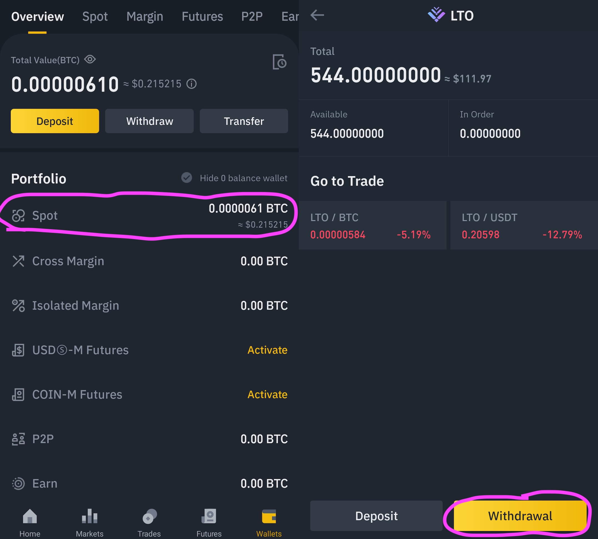
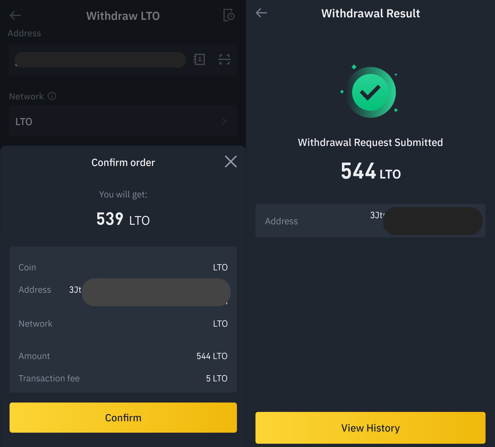

# Binance

## Finding LTO on Binance

To find LTO on Binance simply select _Markets_ in the bottom menu and search for **LTO**. Binance currently offers two trading pairs for LTO:

* LTO/USDT
* LTO/BTC

This means you will need either USDT or BTC on Binance first before you can buy LTO. The easiest way is to buy USDT or BTC directly on Binance and you're good to go.&#x20;


&#x20;If you already own BTC or USDT you can also simply transfer them to your Binance account.


All that's left now is buying LTO and transferring it to your LTO web wallet to stake it.

## Buying LTO on Binance

Once you selected your LTO pair you need to click the buy button. This will open a new view where you now can choose how many LTO to buy. When specifying the amount of LTO you can also click on the 25% / 50% / 75% / 100% to select a percentage of your funds for the current purchase. The last step is to click _Buy LTO_ and you're the proud owner of LTO tokens!

## Transferring LTO from Binance

After you bought your LTO they can be found in your _spot wallet_. To get there click the _Wallets_ tab and select _Spot_ to get the overview of your crypto tokens. Select LTO and you will be able to see your currently available tokens.

Select _Withdrawal_ to start the process. The most important step of the transfer starts now, as you need to provide the recipient information:

* Address - the wallet address you transfer your LTO tokens to
* Network - this is chosen _automatically_ by the app depending on the address you provided
* Amount - how much LTO are you transferring&#x20;

#### Address

Binance automatically parses the address you enter, meaning you can use an LTO mainnet address, an ERC-20 address, or even BEP-20 or BEP-2.


To avoid mistakes simply copy your LTO wallet address by clicking it in the web wallet and pasting it into the address field on Binance.


#### Network

Based on the format of the address Binance decides which network to use. You usually don't need to change anything. For the sake of simplicity, we assume you used an LTO mainnet address.


If you want to stake your LTO on the mainnet you have to use the web wallet at present. If you don't want to stake your LTO you can also directly transfer to, e.g., MetaMask by providing your ERC-20 address and choosing ERC-20 as the Network.


#### Amount

Choose the amount you want to transfer or simply select _MAX_.

#### Confirmation and Sending

The last step is selecting _Withdrawal_ and confirming the transaction. At present Binance retains a 5 LTO fee, meaning the amount transferred to your LTO web wallet will be your chosen amount minus 5 LTO.

Congratulations! After a few seconds, your LTO tokens should already appear in your web wallet.&#x20;
