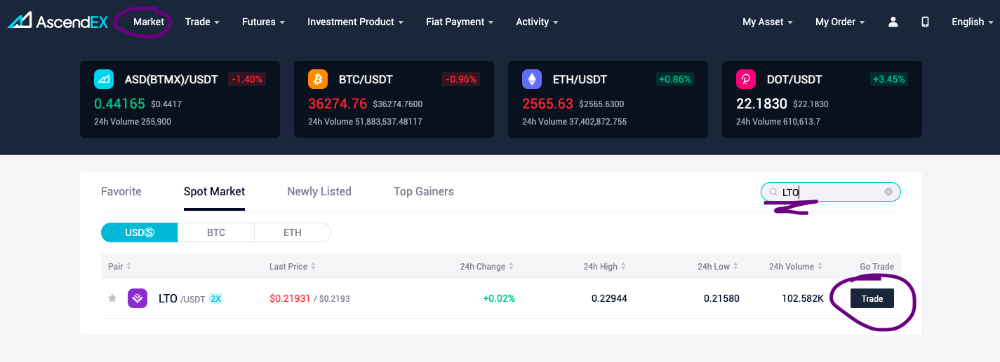
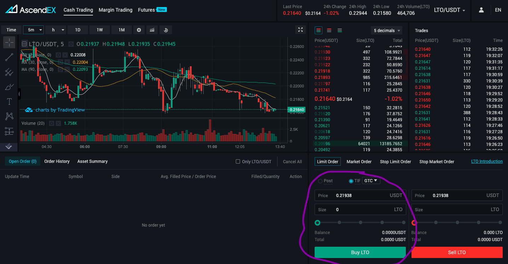
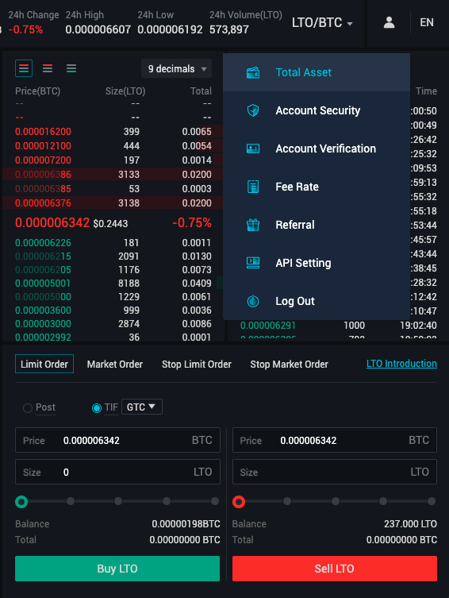
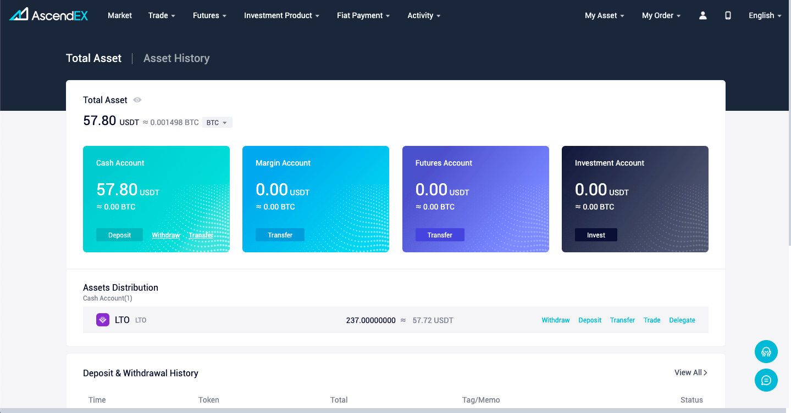
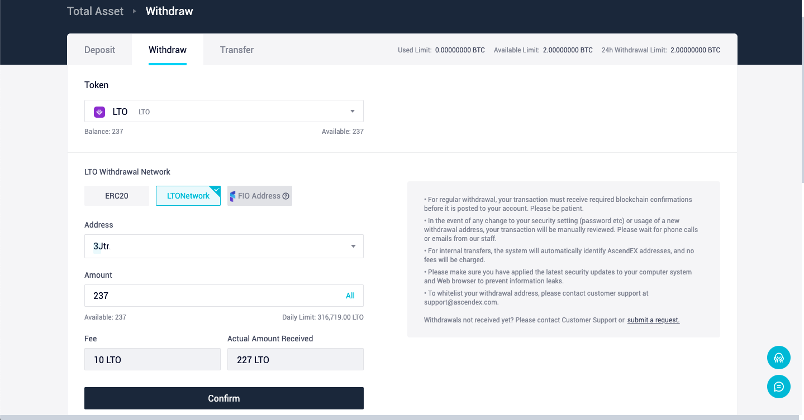

# AscendEX \(Bitmax\)

## Finding LTO on AscendEX

To find LTO on AscendEX simply select _Markets_ in the top menu and search for **LTO**. AscendEX currently offers two trading pairs for LTO:

* LTO/USDT
* LTO/BTC

This means you will need either USDT or BTC on AscendEX first before you can buy LTO. The easiest way is to buy USDT or BTC directly on AscendEX and you're good to go. 


 If you already own BTC or USDT you can also simply transfer them to your AscendEX account.


All that's left now is buying LTO and transferring it to your LTO web wallet to stake it.

## Buying LTO on AscendEX

Once you found the market you need \(see _finding LTO on AscendEX_\) select _Trade_ and you will be forwarded to the LTO trading view:

Select the amount of LTO you want to buy by either typing the amount or using the slider to allocate a percentage of your funds. Clicking on _Buy_ will automatically place the order and once it is executed you can see the LTO tokens in your _Total Asset_ overview.

## Transferring LTO from AscendEX

Selecting your total asset overview in your account will give you a summary of all assets your account currently holds. Hovering over LTO shows you the options to withdraw, deposit, transfer, trade, and delegate. We want to withdraw LTO in this tutorial, so select _Withdraw_.

In the withdraw tab you have the choice of withdrawing your LTO tokens as ERC-20 \(any ETH address, e.g., MetaMask\) or LTO mainnet \(e.g., the LTO web wallet\). For this tutorial, we select the LTO mainnet since the fees are way smaller on the mainnet compared to the ETH network.  


To avoid mistakes simply copy your LTO wallet address by clicking it in the web wallet and pasting it into the address field on AscendEX.


After filling in your address and your amount you're good to go. Select _Confirm_ and then fill in your 2FA information and you're done. The LTO tokens should arrive in your wallet moments later already.

