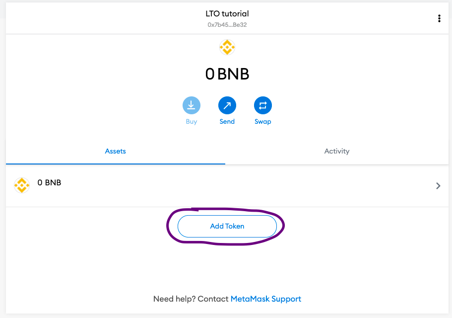
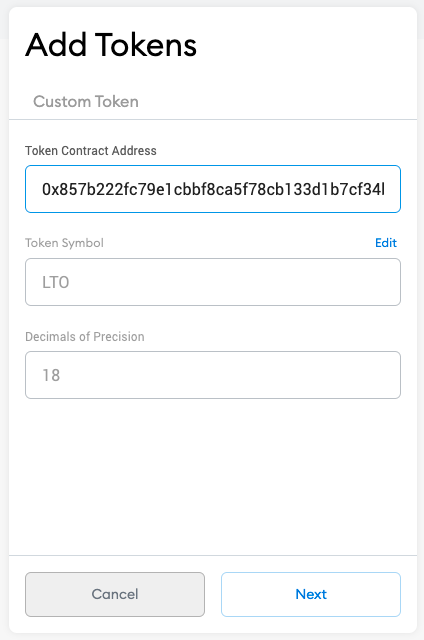
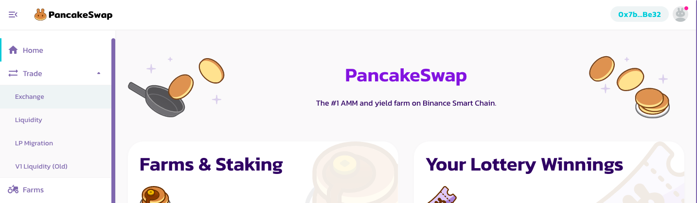
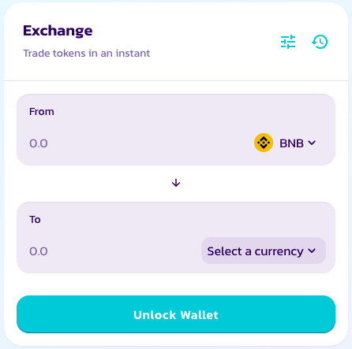
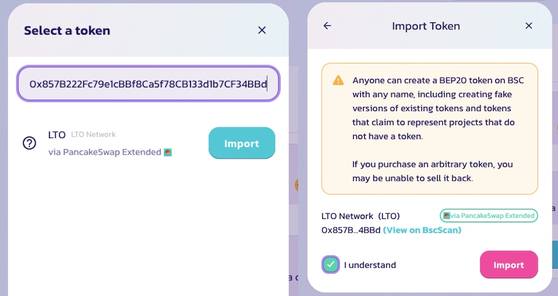
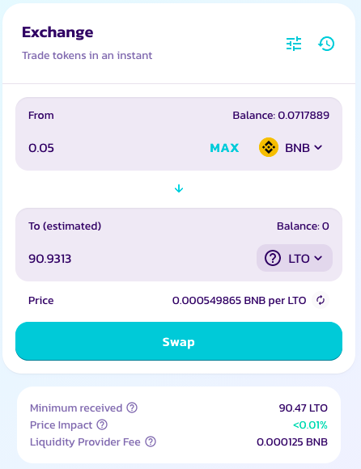
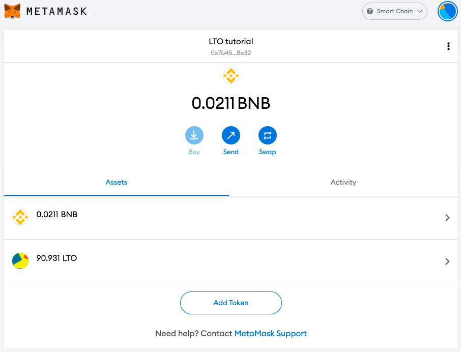

# PancakeSwap

In this tutorial, we'll cover merely the basic steps on how to buy LTO tokens on PancakeSwap. If you require a more in-depth introduction you can refer to [other resources](https://academy.binance.com/en/articles/a-guide-to-pancakeswap). 

## Prerequisites

For the sake of simplicity, we will assume you have a MetaMask wallet that you are using to connect to PancakeSwap and buy LTO tokens. Should you be using another wallet the preparation will have similar steps depending on the wallet used.

### MetaMask configuration

Two steps are required to configure MetaMask for PancakeSwap. First, you need to enable the BNB network on MetaMask. A simple tutorial can be found [here](https://academy.binance.com/en/articles/connecting-metamask-to-binance-smart-chain), follow it and add the **BNB Mainnet**.

Second, after you added the BNB Smart Chain, we can add the LTO token to the MetaMask token overview. Simply tap the _Add token_ button to start the process:

To find LTO you will need to provide LTO's contract address. This ensures that the right token will be added to your token overview.

**LTO BEP-20 address : 0x857B222Fc79e1cBBf8Ca5f78CB133d1b7CF34BBd**

Confirm your selection and you're ready to go. LTO token \(LTO\) should now appear in your MetaMask token overview and you are set up to explore PancakeSwap. 

## PancakeSwap

On PancakeSwap we will be swapping BNB for LTO tokens. First, you need to connect your wallet to PancakeSwap. We will be using MetaMask for this tutorial, see the preparation steps above for the necessary prerequisites. Second, you need to make sure there is actually some BNB in your wallet. If you don't own any BNB you can't swap them for LTO tokens.

### Finding LTO on PancakeSwap

First of all, connect your wallet to PancakeSwap, and in the options menu on the left select _Trade_ &gt; _Exchange_.

Next, you will be presented with the following dialog:

Similar to our import of LTO tokens in MetaMask, we will be adding the token to our transaction. You need to select LTO tokens and import them.


Always double-check the address of the imported token. If it's not **0x857B222Fc79e1cBBf8Ca5f78CB133d1b7CF34BBd** something might not be correct and you should not continue with the import.


### Buying LTO on PancakeSwap

Now you're all set for the swap. Select the amount you wish to swap and if the conditions seem to your liking confirm the swap.

After your confirmation, the swap will be started. Shortly after you should be able to see the results in your MetaMask wallet already:

### Transferring LTO from PancakeSwap

Contrary to our CEX tutorials, if you use a DEX like PancakeSwap there is no need to transfer your tokens from PancakeSwap since they are already in your wallet. However, the current tokens you hold are BEP-20 LTO tokens. We summarized an[ additional tutorial in our blog](https://blog.ltonetwork.com/how-to-swap-lto-bep2-to-lto-bep20/) on how to transfer BEP-20 tokens to BEP-2 tokens and vice versa. To transfer BEP-2 to the mainnet simply refer to our LTO token bridge tutorial on transferring **exchange tokens to mainnet tokens**.


An obvious alternative to LTO's bridge mechanism at this point is Binance itself. If you send the BEP-2 / BEP-20 LTO tokens to your Binance account you will be able to withdraw LTO as any supported token:

* Mainnet,
* ERC-20,
* BEP-2, and
* BEP-20. 




