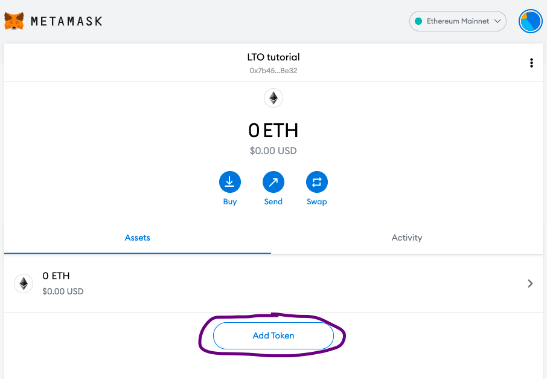
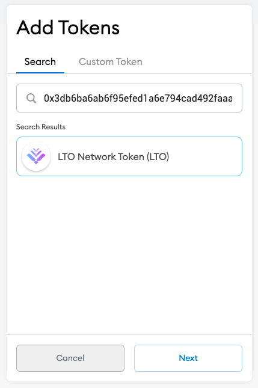
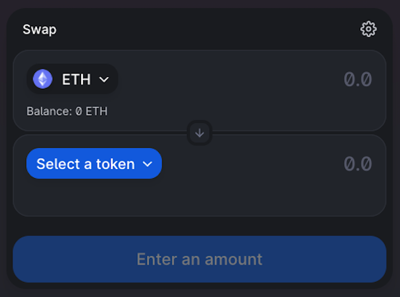
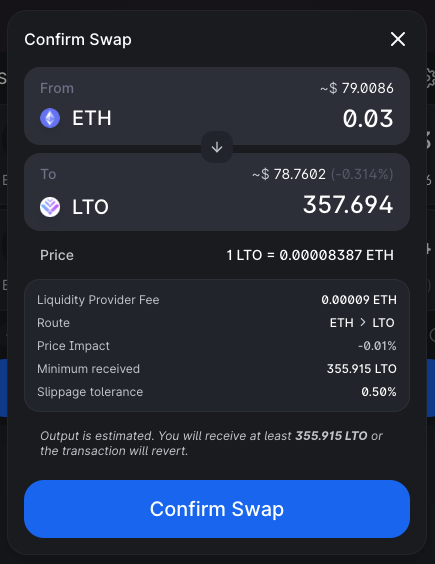
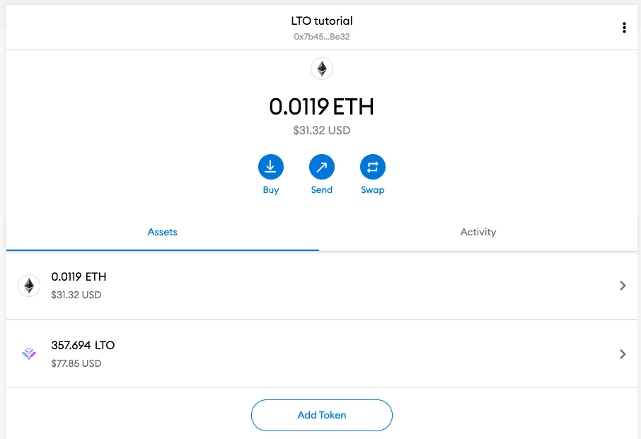

# Uniswap

In this tutorial, we'll cover merely the basic steps on how to buy LTO tokens on Uniswap. If you require a more in-depth introduction you can refer to [other resources](https://academy.binance.com/en/articles/what-is-uniswap-and-how-does-it-work).&#x20;

## Prerequisites

For the sake of simplicity, we will assume you have a MetaMask wallet that you are using to connect to Uniswap and buy LTO tokens. Should you be using another wallet the preparation will have similar steps depending on the wallet used.

### MetaMask configuration

First, you have to add LTO tokens to MetaMask. Simply tap the _Add token_ button to start the process:

To find LTO you will need to provide LTO's contract address. This ensures that the right token will be added to your token overview.

**LTO ERC-20 address : 0x3DB6Ba6ab6F95efed1a6E794caD492fAAabF294D**

Confirm your selection and you're ready to go. LTO Network Token (LTO) should now appear in your MetaMask token overview and you are set up to explore Uniswap.&#x20;

## Uniswap

On Uniswap we will be swapping ETH for LTO tokens. First, you need to connect your wallet to Uniswap. We will be using MetaMask for this tutorial. Second, you need to make sure there is actually some ETH in your wallet. If you don't own any ETH you can't swap them for LTO tokens.&#x20;

### Finding LTO on Uniswap

After connecting your wallet to Uniswap you should be presented with the following dialog:

Similar to our import of LTO tokens in MetaMask, we will be adding the token to our transaction. You need to select LTO Network tokens and import them.


Always double-check the address of the imported token. If it's not **0x3DB6Ba6ab6F95efed1a6E794caD492fAAabF294D **something might not be correct and you should not continue with the import.


### Buying LTO on Uniswap

Now you're all set for the swap. Select the amount you wish to swap and if the conditions seem to your liking confirm the swap.

After your confirmation, the swap will be started. Shortly after you should be able to see the results in your MetaMask wallet already:

### Transferring LTO from Uniswap

Contrary to our CEX tutorials, if you use a DEX like Uniswap there is no need to transfer your tokens from Uniswap since they are already in your wallet. To transfer them to the mainnet simply refer to our LTO token bridge tutorial on transferring exchange tokens (ERC-20) to mainnet tokens.


[using-the-lto-bridge.md](../using-the-lto-bridge.md)

