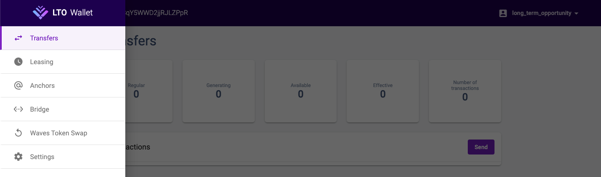
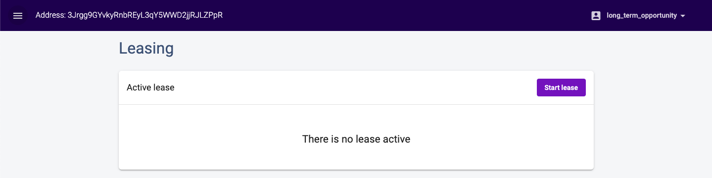
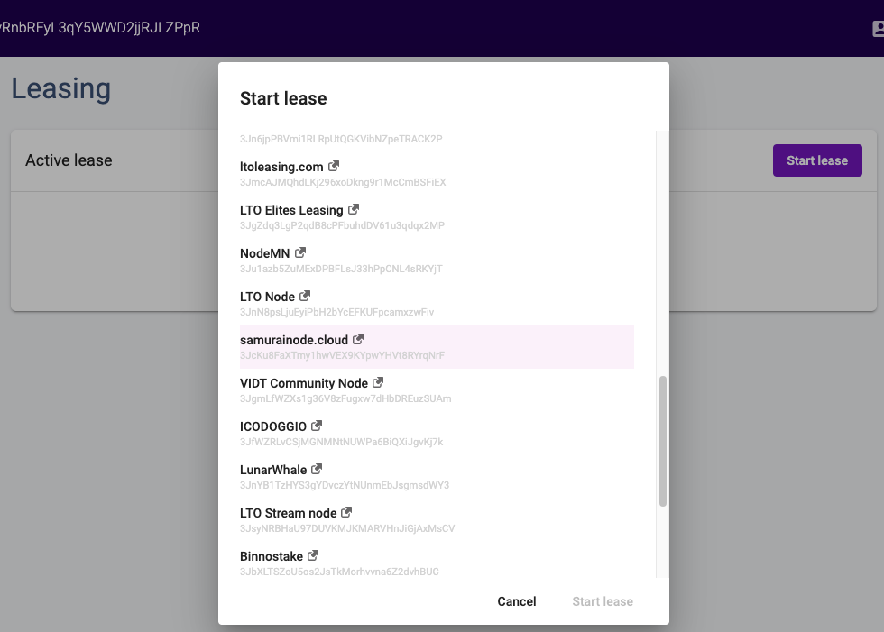

# Staking LTO tokens

## Staking LTO 

Now, that you have your web wallet and bought your LTO tokens from one of the exchanges, you probably want to stake your LTO and make use of the current network APY \(yearly [ROI](https://www.ltonod.es/)\). To do that head to the leasing menu on the left:

Since we have a brand new wallet there are no leases listed here right now. Let's change that by selecting _Start lease_, and chose one of the community nodes to lease to.


While the lease starts nearly immediately, it will take approximately 16 hours to mature. Once a lease matures it starts generating LTO rewards for you.


Select any one of these community nodes and start your lease. You will need to specify how many of your LTO tokens you want to lease, and you will pay a 1 LTO fee for the lease to start.


Leasing _and_ canceling a lease cost 1 LTO each! So if you get your leasing rewards from a node do not cancel your old lease, simply open a new lease for the reward. Otherwise, you'll lose 16 hours and the LTO fees.


And now you've officially staked your LTO! You can check the [public community node overview](https://docs.google.com/spreadsheets/d/1R9OPQxW9dD9anq217ffm9sXINV_xKTNNaiHcY_eOWmw/edit#gid=0) to find out who to contact for node-related questions or when your node pays out rewards.

