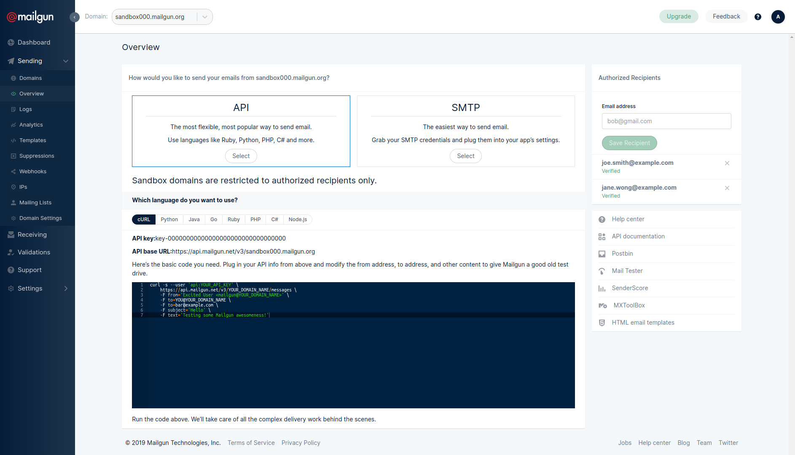

# Invitation by e-mail

In our previous tutorials, only users interacted with the process. An important feature of Live Contract is the ability to interact with both people and systems.

This tutorial will start after the introduction and exchange of the _recipients_ e-mail address. The _initiator_ is organizing a meetup and wants to invite the people he met at the conference via e-mail.


Create a new subdirectory named `invitation` and copy `main.feature` and `scenario.yml` from the `condition` subdirectory.


We'll only focus on the situation where the _recipient_ gives her e-mail address and the process is completed successfully.

```text
Feature: Initiator invites the recipient to a meetup.

  Background:
    Given a chain is created by "Joe"
    Given "Joe" creates the "main" process using the "invitation" scenario
    And   "Joe" is the "initiator" actor of the "main" process
    And   "Jane" is the "recipient" actor of the "main" process

  Scenario:
    When "Joe" runs the "introduce" action of the "main" process with:
      | name         | Joe Smith     |
      | organization | LTO Network   |
    Then the "initiator" actor of the "main" process has:
      | name         | Joe Smith     |
      | organization | LTO Network   |
    And the "main" process is in the "initial" state

    When "Jane" runs the "introduce" action of the "main" process with:
      | name         | Jane Wong     |
      | organization | Acme Inc      |
    Then the "recipient" actor of the "main" process has:
      | name         | Jane Wong     |
      | organization | Acme Inc      |
    And the "main" process is in the "wait_on_initiator" state

    When "Joe" runs the "request_email" action of the "main" process
    Then the "main" process is in the "wait_on_recipient" state

    When "Jane" runs the "reply" action of the "main" process with:
      | email        | jane.wong@example.com |
    Then the "recipient" actor of the "main" process has:
      | name         | Jane Wong             |
      | organization | Acme Inc              |
      | email        | jane.wong@example.com |
    And the "main" process is in the "pending_invitation" state

    When "Joe" runs the "invite" action of the "main" process
    Then the "main" process is completed
```

In that case _Joe_ needs to manually invite _Jane_ \(and all other invitees\) by e-mail. Luckily, the workflow engine supports running actions in an automated manner.

## The invite action

An important aspect of a Live Contract is that it only defines what should be done and not how it must be done. In this case we'll define that the _initiator_ should send an e-mail. The way that's done is up to the actor that performs the action.



```yaml
actions:
  introduce:
    actors:
      - initiator
      - recipient
    condition: !eval current.actor.name == null
    update: current.actor
  request_email:
    actor: initiator
  reply:
    actor: recipient
    update: actors.recipient
  invite:
    $schema: http://exmple.com/schemas/invite/schema.json#
    actor: initiator
    invitee: !ref actors.recipient
    message: Please come to great Meetup next week.

states:
  initial:
    action: introduce
    transitions:
      - transition: wait_on_initiator
        condition: !eval actors.initiator.name != null && actors.recipient.name != null
  wait_on_initiator:
    action: request_email
    transition: wait_on_recipient
  wait_on_recipient:
    action: reply
    transitions:
      - transition: pending_invitation
        condition: !eval actors.recipient.email != null
      - transition: :cancelled
        condition: !eval actors.recipient.email == null
  pending_invitation:
    action: invite
    transition: :success
```



```javascript
{
    "actions": {
        "introduce": {
            "actors": [
                "initiator",
                "recipient"
            ],
            "condition": {
                "<eval>": "current.actor.name == null"
            },
            "update": "current.actor"
        },
        "request_email": {
            "actor": "initiator"
        },
        "reply": {
            "actor": "recipient",
            "update": "actors.recipient"
        },
        "invite": {
            "$schema": "http://exmple.com/schemas/invite/schema.json#",
            "actor": "initiator",
            "invitee": "actors.recipient",
            "message": "Please come to great Meetup next week."
        }
    },
    "states": {
        "initial": {
            "action": "introduce",
            "transitions": [
                {
                    "transition": "wait_on_initiator",
                    "condition": {
                        "<eval>": "actors.initiator.name != null && actors.recipient.name != null"
                    }
                }
            ]
        },
        "wait_on_initiator": {
            "action": "request_email",
            "transition": "wait_on_recipient"
        },
        "wait_on_recipient": {
            "action": "reply",
            "transitions": [
                {
                    "transition": "pending_invitation",
                    "condition": {
                        "<eval>": "actors.recipient.email != null"
                    }
                },
                {
                    "transition": ":cancelled",
                    "condition": {
                        "<eval>": "actors.recipient.email == null"
                    }
                }
            ]
        },
        "pending_invitation": {
            "action": "invite",
            "transition": ":success"
        }
    }
}
```



### JSON Schema for actions

Up until now, we've only used the default schema for an action. Actions that may be automated should contain all information required to run them. The structure of such an action must be defined in a custom JSON Schema.

The _invite_ action uses a custom JSON Schema, specified with `$schema`. The schema may be publicly available at the specified URL or can be distributed as part of the Live Contract.



```javascript
{
    "$schema": "http://json-schema.org/draft-04/schema#",
    "type": "object",
    "properties": {
        "actor": {
            "type": "string"
        },
        "invitee": {
            "type": "object",
            "properties": {
                "name": {
                    "type": "string"
                },
                "email": {
                    "type": "string",
                    "format": "email"
                }
            }
        },
        "subject": {
            "type": "string"
        },
        "message": {
            "type": "string"
        }
    }
}
```



```javascript
{
    "title": "JSON schema for invite action",
    "$schema": "http://json-schema.org/draft-07/schema#",
    "type": "object",
    "properties": {
        "actor": {
            "type": "string"
        },
        "invitee": {
            "type": "object",
            "properties": {
                "name": {
                    "type": "string"
                },
                "email": {
                    "type": "string"
                }
            }
        },
        "subject": {
            "type": "string"
        },
        "message": {
            "type": "string"
        }        
    }
}
```




It's recommended, though not required, that every actor in the process has a copy of the JSON Schema. Actors that may perform the action do require the schema.


## Mailgun e-mail service

For this tutorial we'll send an e-mail through Mailgun using their REST API.


* Visit [https://www.mailgun.com/](https://www.mailgun.com/) and sign up. _Mailgun is free up to 10.000 e-mails per month._
* On the 'Sending' page, select your sandbox URL.
* Add your e-mail address to 'Authorized Recipients' and verify it.





This tutorial uses `sandbox000.mailgun.org` as endpoint, a dummy API key and `jane.wong@example.com` as e-mail address. Replace that with the \(long\) sandbox URL, your Mailgun API key and your own e-mail address.


## Trigger

A node can define a trigger for an action schema. If an actor on the node is allowed to perform the action the workflow engine will automatically do so.

Triggers are defined through the configuration of the workflow engine. In order to use a custom configuration, please stop docker and than create and link a new directory `workflow-settings`.

```text
$ docker-compose stop
```

In the `workflow-settings` directory, create a `settings.yml` file with custom configuration settings. In that file, we'll define a custom trigger for the _invite_ schema.

```yaml
triggers:
  invite:
    type: http
    $schema: http://exmple.com/schemas/invite/schema.json#
    url: sandbox000.mailgun.org
    method: POST
    auth: 
      username: api
      password: key-00000000000000000000000000000000
    headers:
      Content-Type: application/x-www-form-urlencoded
    data:
      from: joe.smith@example.com
      subject: You are invited to our Meetup
    projection: "{ data: { to: join('', [invitee.name, ' <', invitee.email, '>']), text: message } }"
```

The `projection` is a [JMESPath expression](http://jmespath.org/) that converts the action into an object that's expected by the HTTP trigger.

The `data` will be encoded and send as request body. The data parameters are described by the [Mailgun API](https://documentation.mailgun.com/en/latest/api-sending.html#sending). The data in the trigger is merged with the data from the projection.


Triggers are configured by each party on their own node. This node will be configured to send an e-mail using Mailgun, but any other service could be used or an entirely different action could be taken to invite the recipient.


### Testing the HTTP request

Enable outgoing capturing HTTP requests in `workflow-settings/settings.yml` by adding the following setting

```yaml
http_request_log: true
```

In the test, we can check if the workflow engine has send a specific HTTP request.

```text
Feature: Initiator invites the recipient to a meetup.

  Background:
    Given a chain is created by "Joe"
    Given "Joe" creates the "main" process using the "handshake" scenario
    And   "Joe" is the "initiator" actor of the "main" process
    And   "Jane" is the "recipient" actor of the "main" process

  Scenario:
    When "Joe" runs the "introduce" action of the "main" process with:
      | name         | Joe Smith     |
      | organization | LTO Network   |
    Then the "initiator" actor of the "main" process has:
      | name         | Joe Smith     |
      | organization | LTO Network   |
    And the "main" process is in the "initial" state

    When "Jane" runs the "introduce" action of the "main" process with:
      | name         | Jane Wong     |
      | organization | Acme Inc      |
    Then the "recipient" actor of the "main" process has:
      | name         | Jane Wong     |
      | organization | Acme Inc      |
    And the "main" process is in the "wait_on_initiator" state

    When "Joe" runs the "request_email" action of the "main" process
    Then the "main" process is in the "wait_on_recipient" state

    When "Jane" runs the "reply" action of the "main" process with:
      | email        | jane.wong@example.com |
    Then the "recipient" actor of the "main" process has:
      | name         | Jane Wong             |
      | organization | Acme Inc              |
      | email        | jane.wong@example.com |
    And a "POST" request has been send to "https://api.mailgun.net/v3/sandbox000.mailgun.org/messages" with:
      | from    | info@example.com                       |
      | to      | Jane Wong <jane.wong@example.com>      |
      | subject | You are invited to our Meetup          |
      | text    | Please come to great Meetup next week. |
    And that request received a "200" response with:
      | message | Queued. Thank you.                     |

    Then the "main" process is completed
```


The workflow engine can only capture outbound HTTP requests. It can't mock requests, but needs to work with an actual service or you need to setup a custom mocked service yourself.


