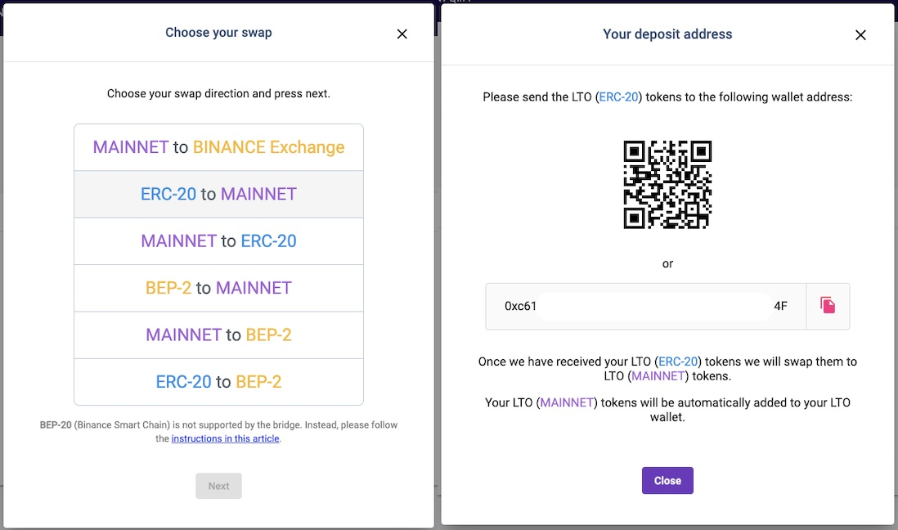

# Setup your node wallets

## **Wallets for your node**

Don’t have an LTO Network wallet yet? Create one at [https://wallet.lto.network.](https://wallet.lto.network./)You need mainnet tokens to be able to stake \(be part of the network with your tokens\). If you don't have any LTO tokens yet you might want to check out tutorials about Buying LTO:



Otherwise, chances are you already have tokens. Here are two additional edge cases that might apply to you if you already own LTO:

* Do you have ERC-20 or BEP-2 LTO tokens? Transfer them to mainnet tokens using the bridge function in the wallet interface. You can also refer to our tutorial at:



* Do you still have Investor Seed \(Waves\) tokens? Transfer them using the Waves Token Swap option in your freshly created wallet.

The wallet you just created is \(will be\) your personal wallet. We’ll want another wallet which we’ll use just for staking. This new wallet will also receive the earnings. Go ahead and create another wallet. We’ll use the lease function of the LTO Network to lease your tokens from your personal wallet to the 2nd wallet.

As always make sure to write down the seeds of your wallet\(s\). You can use these to recover your wallet later if needed. Also, you’ll need the seed later on when configuring your Public node.

## **Leasing to your node**

The next step is creating your lease. You will want to lease your tokens from your personal wallet \(Wallet \#1\) to your 2nd wallet \(the wallet we’ll use for the node\).

As a first step click the “Start lease” button:

* Specify the recipient: &lt;the address of your 2nd wallet&gt;
* Specify the amount \(max = balance minus fee\): &lt;enter a number&gt;

Click Start lease and confirm to activate.

You can check out your 2nd wallet and see the lease was successful.

You’ll need at least 1.000 LTO in your wallet to be able to run a node. You probably want to make sure you have 10.000+ LTO. You can utilize the [Community ROI calculator](https://lto-lease.com/tools/roi) to calculate your possible benefits.

Next up is configuring your Public node. You can choose from multiple deployment methods outlined on the public node subpages:



 Happy staking!

