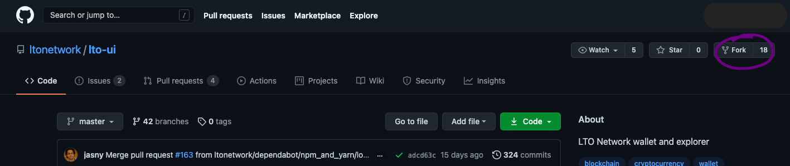
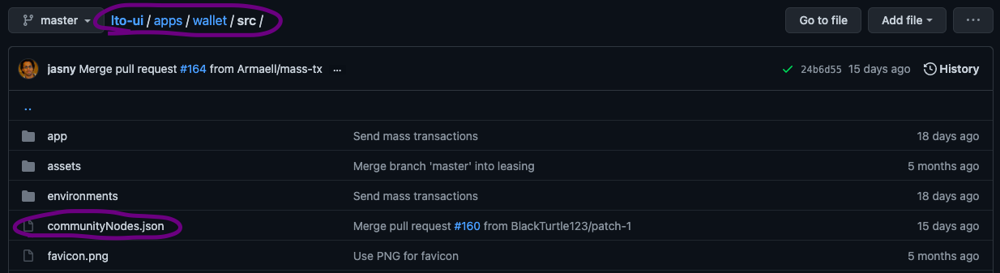
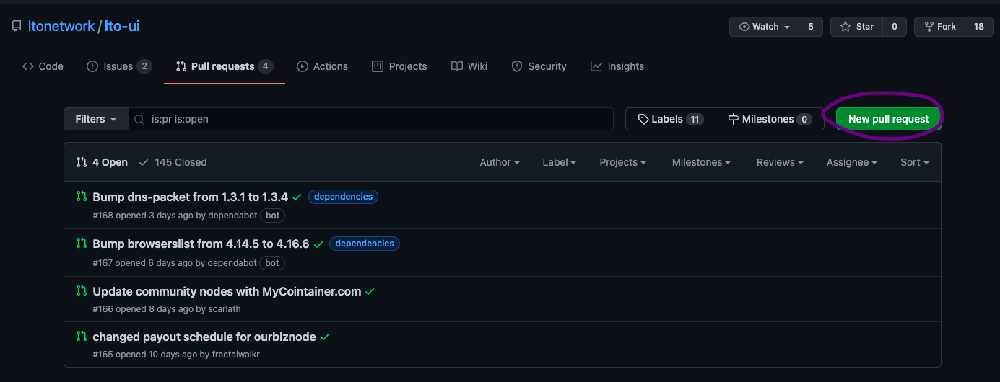

# Public community nodes

## Becoming a public community node

Anyone can become a public node on the LTO network as long as all prerequisites are met, the necessary contact info has been made available to the community, and basic git proficiency is part of your repertoire.

### Prerequisites

To take your node public you obviously need to set up your own node first. If you haven't done so feel free to refer to our tutorials in this regard:





Furthermore, it helps a lot if you already demonstrated your ability to do payouts, e.g., through the community-provided payout script. Refer to the _Node management_ tutorial for more information.



### Information disclosure

The team keeps track of the public community nodes in a [separate document](https://docs.google.com/spreadsheets/d/1R9OPQxW9dD9anq217ffm9sXINV_xKTNNaiHcY_eOWmw/edit#gid=0). To get listed there you need to provide [Christian Zhang](https://t.me/ChristianZH) with the following info:

* Node LTO Address
* Your Telegram Name
* Node Name
* Node Website / Telegram Channel
* The Payout schedule

### Web wallet listing/lease tab

The last step is getting listed in the official web wallet. You will require a github account and you will need to create a pull request with your node as part of the lease tab list.

First things first, head over to github, and if you don't have an account already create one. Once you're done go to the [LTO UI project page](https://github.com/ltonetwork/lto-ui) and fork the project.

Now you should have your local fork of the LTO UI project in your own github. To include your node in the community nodes leasing tab you will need to edit the communityNodes.json. Input your node data at the end of the list, same as the other nodes. The list is randomized before being displayed in the web wallet lease tab, so the position in the web wallet is different each time.

All that's left is for you to create a pull request with the [original LTO UI project](https://github.com/ltonetwork/lto-ui). That's it, you're done. As soon as the pull request is granted by the LTO team your node will be part of the leasing tab the next time there is a new build. Congratulations!

