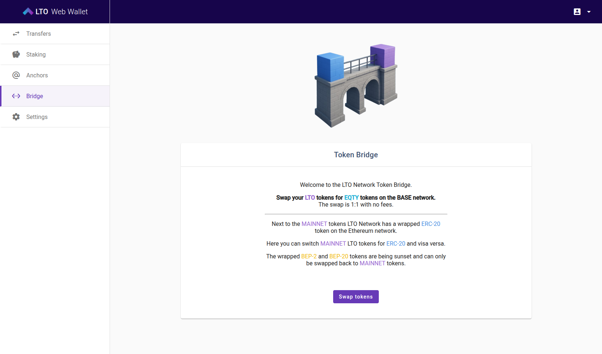
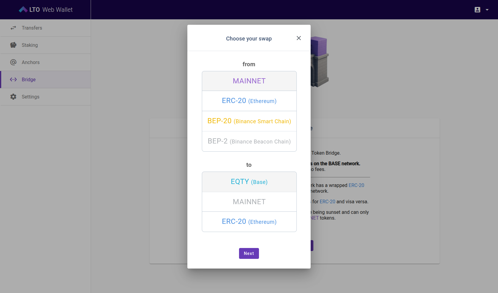
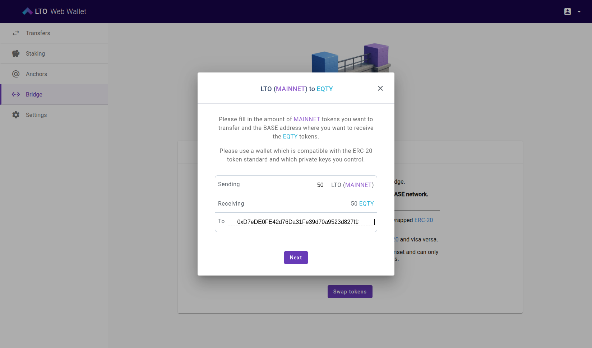
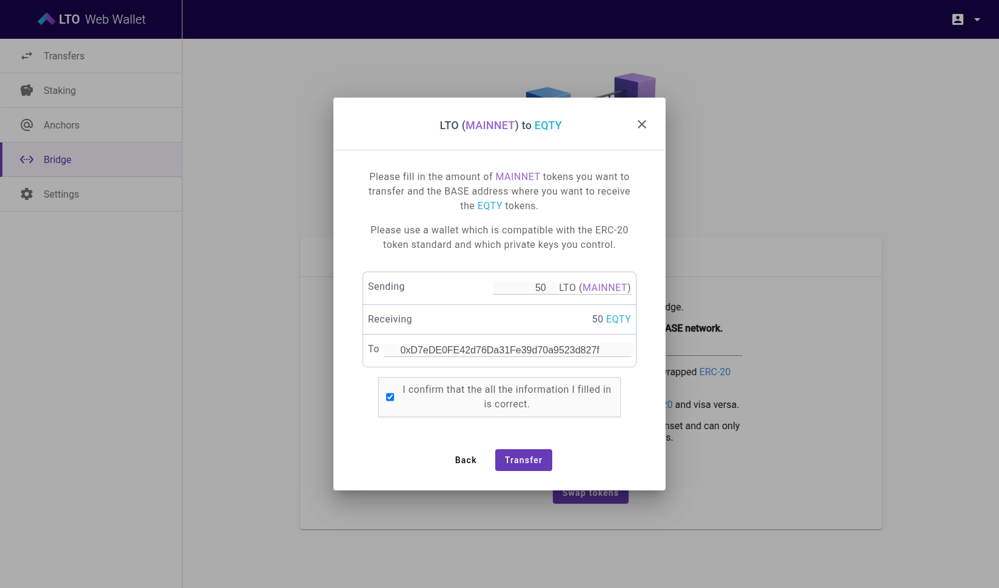
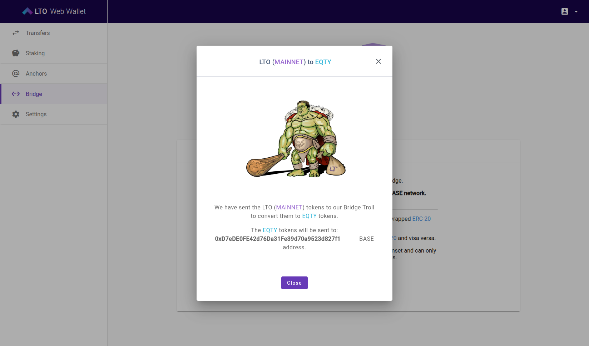
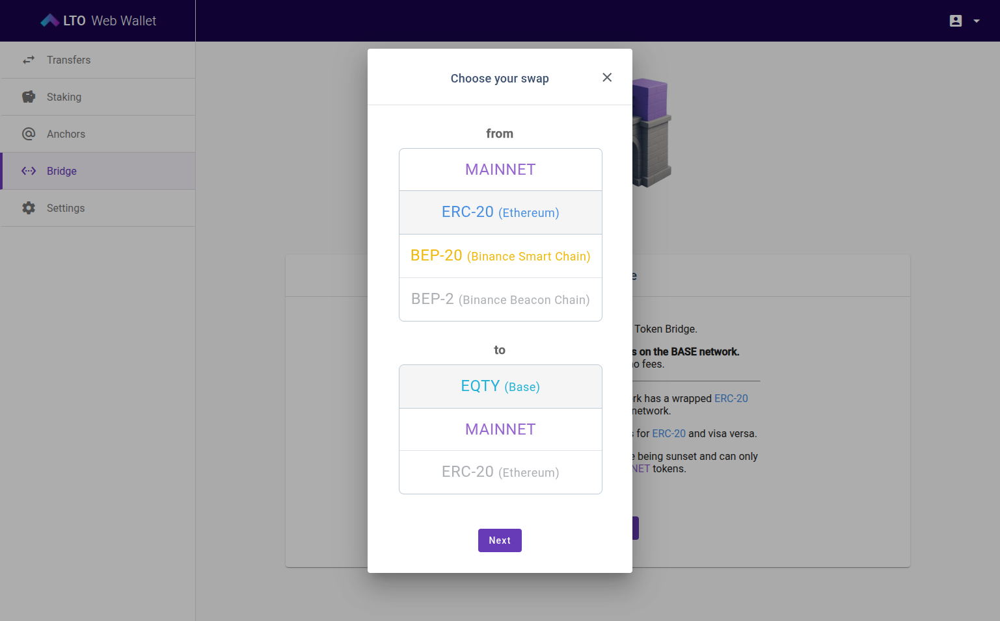
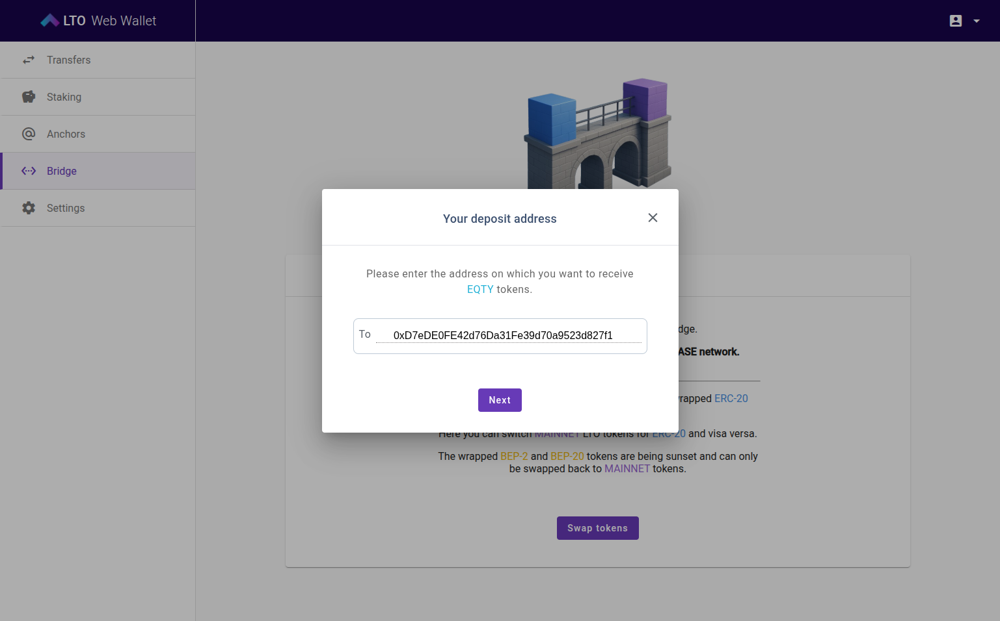
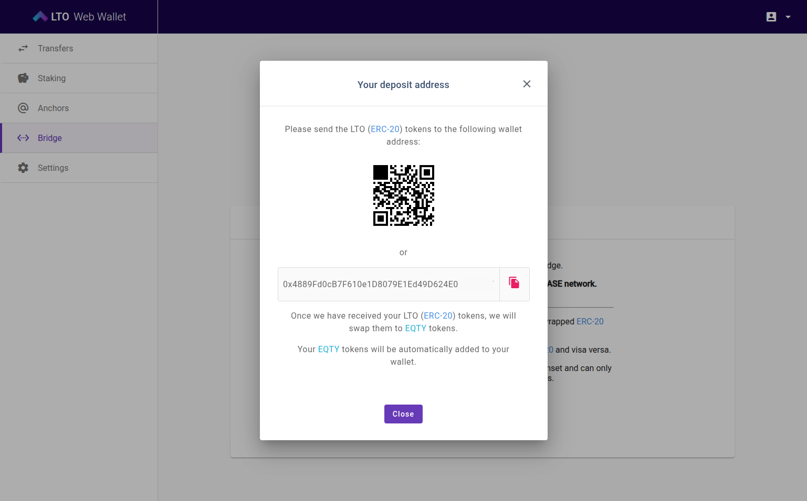

# Swapping LTO to EQTY

The LTO Web Wallet allows you to swap your tokens for EQTY on the Base network. The swap is **1:1 and free of charge**. You can swap both **LTO Mainnet tokens** and **wrapped tokens (ERC-20 or BEP-20)**.


Swapping is only available between **September 1, 00:00 UTC** and **October 31, 23:59 UTC**. Make sure to complete your swap before the deadline.


EQTY is an ERC-20 token deployed on the **Base network** with smart contract addres&#x73;**:** `0xc71f37d9bf4c5d1e7fe4bccb97e6f30b11b37d29`

You can verify the contract on **BaseScan** here: [EQTY on BaseScan](https://basescan.org/token/0xc71f37d9bf4c5d1e7fe4bccb97e6f30b11b37d29)

## Setting up your Base wallet

Before you can swap LTO into EQTY, you need a wallet on the **Base network**. This wallet will hold your EQTY tokens. Popular options are MetaMask, Trust Wallet, Coinbase Wallet, Exodus, and Ledger.

Below you’ll find instructions and links to official guides. You only need to set up **one** of these wallets or any other wallet that support EVM chains.



### MetaMask

[Download MetaMask](https://metamask.io/download) for your browser or mobile. Follow the [Getting started guide](https://support.metamask.io/start/getting-started-with-metamask/) to create or import a wallet.

MetaMask supports Base. You should be able to select it under "Networks".  If Base is not listed, you can add it manually:

* Network name: Base Mainnet
* RPC URL: `https://mainnet.base.org`
* Chain ID: `8453`
* Currency symbol: `ETH`

Guide: [Custom networks in MetaMask](https://support.metamask.io/more-web3/learn/user-guide-custom-networks-and-sidechains/).

To see EQTY in MetaMask, import it as a **Custom Token**:

* Contract address: `0xc71f37d9bf4c5d1e7fe4bccb97e6f30b11b37d29`
* MetaMask will automatically detect the symbol and decimals

Guide: [Display tokens in MetaMask](https://support.metamask.io/manage-crypto/tokens/how-to-display-tokens-in-metamask/?utm_source=chatgpt.com).



### Trust Wallet

[Download Trust Wallet](https://trustwallet.com/download) for iOS, Android, or Chrome extension.

Trust Wallet natively supports the Base network.

To add EQTY:

* Tap **Add Custom Token**
* Choose **Base** as the network
* Paste the EQTY contract address: `0xc71f37d9bf4c5d1e7fe4bccb97e6f30b11b37d29`

Reference: [How to Add a Custom Token using Trust Wallet](https://trustwallet.com/blog/web3/how-to-add-a-custom-token-using-trust-wallet)



### Coinbase Wallet

Install [Coinbase Wallet](https://www.coinbase.com/wallet) on mobile or as a browser extension.

Coinbase Wallet has Base support out of the box. Simply select **Base** in the network menu.

EQTY will appear automatically when you receive it at your Base address.

Reference: [Tokens in Coinbase Wallet – Base docs](https://docs.base.org/base-chain/tools/tokens-in-wallet).


EQTY may appear in Coinbase Wallet without a logo and with limited information until it's propertly listed on CoinMarketCap and/or CoinGecko.




## Exodus Wallet

[Download Exodus](https://www.exodus.com/download) for desktop or mobile.

Exodus supports Base accounts directly. To add EQTY:

* **Mobile:** Tap Wallet → Profile → Assets → **+**, choose **Base**, and paste the EQTY contract address.
* **Desktop:** Settings → Assets → **Add Custom Token**, select **Base**, and paste the EQTY contract address.

**EQTY contract address:** `0xc71f37d9bf4c5d1e7fe4bccb97e6f30b11b37d29`

Reference: [Exodus – How to add a custom token](https://www.exodus.com/support/en/articles/8598810-how-do-i-add-a-custom-token).\
Reference: [Explore the Base ecosystem with Exodus](https://www.exodus.com/support/en/articles/8717855-explore-the-base-web3-ecosystem-with-exodus).



## Ledger device

[Buy a Ledger](https://www.ledger.com/) and [download Ledger Live](https://www.ledger.com/ledger-live) to manage it.

Ledger Live supports Base. To use EQTY on Base with your Ledger:

* Connect your Ledger to MetaMask or Exodus
* Select the Base network in that wallet
* Add EQTY using the contract address: `0xc71f37d9bf4c5d1e7fe4bccb97e6f30b11b37d29` as a custom token (via MetaMask or Exodus)

Reference: [Ledger support for Base](https://support.ledger.com/article/13334147998877).




During the swap process you will need to provide your **Base wallet address**. Make sure you have it ready once your wallet is set up.


## Swapping LTO (Mainnet) to EQTY

### Step 1 – Log into the Web Wallet

Go to [https://wallet.lto.network](https://wallet.lto.network) and sign in. If your account is not listed, restore it from your seed phrase or connect via Universal Wallet or Ledger.


**Important:** If your LTO tokens are **leased**, you must cancel the lease first. There is an **unbonding period of 3000 blocks (about 2 days)**. Only after unbonding can you swap your tokens.


### Step 2 – Open the Bridge

Click **Bridge** in the left-hand menu, then select **Swap tokens**.

<figure><figcaption></figcaption></figure>

### Step 3 – Choose the Swap

Select:

* **From:** MAINNET
* **To:** EQTY (Base)

Click **Next**.

<figure><figcaption></figcaption></figure>

### Step 4 – Enter Swap Details

* Enter the amount of **LTO (Mainnet)** you want to swap.
* The receiving amount of EQTY will be shown (always 1:1).
* Paste your Base address in the **To** field.

Click **Next**.

<figure><figcaption></figcaption></figure>

### Step 5 – Confirm and Transfer

Double-check the details:

* Amount of tokens
* Destination Base address

Tick the confirmation box, then press **Transfer**.

<figure><figcaption></figcaption></figure>

### Step 6 – Completion

The bridge will convert your LTO (Mainnet) tokens into EQTY. You’ll see a success message showing the Base address that will receive them. Click **Close**. Your EQTY tokens will appear in your Base wallet.

<figure><figcaption></figcaption></figure>

✅ Done! You’ve successfully swapped your LTO into EQTY.


The swap normally takes around **15 minutes**. If it takes longer than **1 hour**, something is wrong. Please fill out [this form](https://docs.google.com/forms/u/1/d/1rmAciVHi4B2ZclVvWZOQo3b7VgQmC6vdoG5pUfUDwqM).


## Swapping Wrapped Tokens (ERC-20 or BEP-20) to EQTY

You can also swap LTO tokens from Ethereum (ERC-20) or Binance Smart Chain (BEP-20) directly into EQTY. This can be useful if you already hold your tokens on an exchange or in a wallet outside of LTO Mainnet.

### Step 1 – Log into the Web Wallet

Go to [https://wallet.lto.network](https://wallet.lto.network) and sign in. If you don't have an account, you can create a new one. The account is not used when swapping from ERC-20 / BEP-20 to EQTY.

### Step 2 – Start the Swap

Go to the **Bridge** page and click **Swap tokens**.

<figure><figcaption></figcaption></figure>

### Step 3 – Choose the Swap

Select your wrapped token type as the source:

* ERC-20 (Ethereum)
* BEP-20 (Binance Smart Chain)

Select **EQTY (Base)** as the destination. Click **Next**.

<figure><figcaption></figcaption></figure>

### Step 4 – Enter Your EQTY Address

Paste your Base address where you want to receive EQTY tokens. Click **Next**.

<figure><figcaption></figcaption></figure>

### Step 5 – Get Your Deposit Address

The wallet will show you a **deposit address** for the wrapped tokens. Send your LTO (ERC-20 or BEP-20) tokens to this address using your Ethereum / BSc wallet (eg Metamask or Trustwallet). You may also send tokens directly from a centralized exchange.

You can scan the QR code or copy the address.

<figure><figcaption></figcaption></figure>

### Step 5 – Completion

Once the bridge has received your wrapped tokens, it will automatically mint EQTY and deliver them to your Base wallet.

✅ Done! You’ve successfully swapped your LTO into EQTY.


The swap normally takes around **15 minutes**. If it takes longer than **1 hour**, something is wrong. Please fill out [this form](https://docs.google.com/forms/u/1/d/1rmAciVHi4B2ZclVvWZOQo3b7VgQmC6vdoG5pUfUDwqM).

