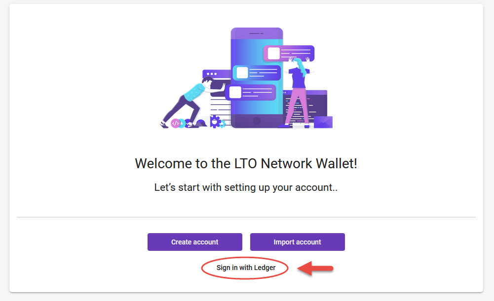

# Using Ledger

## How to: Install LTO app on Ledger

A Ledger device is a hardware wallet. Hardware wallets are considered very secure for the storage of a user’s private keys in the blockchain. Your digital assets are safe even when used on an infected or untrusted computer.‌

Please note that this tutorial applies only to **Native LTO coins \(LTO Mainnet\)**. Do not try to send or receive tokens directly from Ethereum or Binance chains as your funds may be lost forever!‌

### Before you begin 

* You have initialized your Ledger device
* The latest firmware has been installed
* Ledger Live is ready to use‌

### Install the LTO Network app on your Ledger Nano 

1. Open the Manager in Ledger Live.
2. Connect and unlock your Ledger Nano.
3. If asked, allow the manager on your device by pressing the right button.
4. Find LTO Network in the app catalog.
5. Click the Install button of the app.
6. An installation window appears.
7. Your device will display Processing…
8. The app installation is confirmed.

There are currently multiple ways to interact with the LTO Network blockchain using a Ledger hardware wallet: the **Official Web Wallet** and **third-party wallets like stakely.io and an installable CLI Wallet.**

## Connect**ing** Ledger \(Official Web Wallet\)

In order to connect your Ledger device in the wallet, connect your Ledger Device to your computer and open the LTO Network app. Make sure it's connected to your browser and go to [https://wallet.lto.network/ ](https://wallet.lto.network/)and click on **Ledger Device**. This will open up the wallet for your account.

### Interface

The interface is exactly the same as described on the [Official Web UI](wallet-web-app.md) page. The only addition while using a Ledger device is that it requires to sign transactions by physically touching your Ledger device.

### Signing transactions

On-chain actions need to be signed with your keys, and will therefore need the Ledger to be connected.  
After you click Send, Lease or any other action, it will prompt you to sign with the Ledger device.

In case you want to sign the transaction, acknowledge the signing process on your Ledger device with "accept and send".

