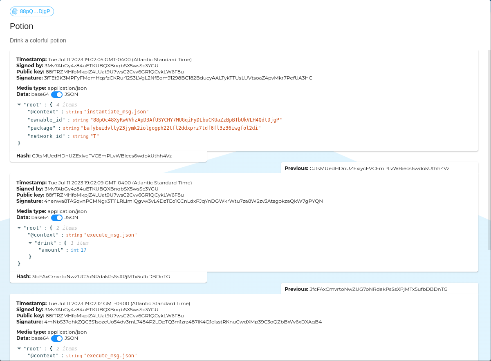

# What is LTO Network?

LTO Network is a hybrid blockchain, with a public and a private layer. It focuses on ownership of digital (off-chain) and real-world assets.

## Truly permissionless

The public layer is a proof-of-stake permissionless blockchain with a fixed set of transaction types. It has a different approach to on-chain statements, which does not include smart contracts.

> _Anyone can talk. Nobody has to listen._

While most blockchains are permissionless on a global level, permissions are introduced through smart contracts. A smart contract keeps track of a custom state, which determines what statements _(as calls to the contract)_ are accepted onto the chain. Secondly, the contract allows a verifier to get concrete answers based on the state.

LTO has a different approach. Any statement is allowed onto the blockchain, as long as the fee is paid. The verifier is the end-user (application) and determines which statements to consider and which to ignore. It's also up to the verifier to determine an answer based on the set of statements.

Let's have a look at an example...

### Example

Volvo created a car and sold it to Arnold, which in term sold it to Bob.

We could represent this with an NFT smart contract. The NFT is minted by Volvo and transferred to Arnold, who transfers it to Bob. The verifier can ask the contract who the current owner is: Bob.

On LTO, we would present this as 3 statements. Each statement would have the same subject, which should be a unique reference to the car. To find out the current owner, a verifier needs to track the car from the manufacturer, following all related statements.

#### Invalid statement

Xavier wants to make a statement that he transferred the car to David.&#x20;

With a smart contract, this statement would be denied, as Xavier isn't the owner of the car.

On LTO, Xavier is able to publish this statement on-chain. A verifier will disregard this statement because it doesn't come across it when tracking it from the manufacturer.

#### Authorized statement

Since we're tracking a real-world asset, we might come across a situation where an authority, like law enforcement, has taken hold of an asset without the consent of the current owner.

To make this possible with a smart contract, the issuers must keep a list of authorized accounts that are able to seize a token.

On LTO, the police can publish this statement on-chain. It's up to the verifier to determine if should honor this statement, making David the current owner.

### Responsibility

Looking at the previous example, we can see the key difference between the smart contract and the approach taken by LTO Network.

With a smart contract, it's the original issuer that determines which statements should be accepted. This does not match the scenario in the real world. It's typically not up to the manufacturer of the car to determine which authority is recognized and which isn't.

With statements on LTO Network, it's up to the verifier to determine with authority to recognize. This more closely resembles the real-world situation, where it's up to a potential buyer to ensure he's purchasing the car from the legal owner.

### Conclusion

The design choices make LTO Network better suited for mimicking real-world scenarios and tracking off-chain assets than most other blockchains. On the other hand, it makes it less suited for on-chain assets, as validators might come to a different conclusion if they don't follow the same ruleset.

Putting the responsibility of validation on the end-user (application) is uncommon for a blockchain, but very common for other decentralized technologies. For example; anyone can issue a [verifiable credential](protocol/identities/verifiable-credentials.md). It's up to the recipient of the verifiable claim to determine whether or not to accept it.

Because of this, it will feel more natural to combine non-blockchain decentralized technologies with LTO Network than with most other blockchains.

## Decentralized graph

Smart contracts provide an isolated state. With LTO Network, we need to consider all data on the network to make conclusions. The best way to look at the information on the LTO public blockchain is as a decentralized directed graph.

A graph is made up of points (also called vertices) connected with edges. Both the points and edges can have data. On LTO, the points are accounts and the edges are created through associations.

### Statements

The graph can help determine which statements to consider and which to ignore. There are different kinds of statements that can be made. Off-chain these are in the form of verifiable credentials. On-chain, there are statement transactions allowing a public statement about any subject and/or another account.

Anchoring can also be seen as a statement. It's limited to just publishing a hash, but more cost-efficient.

### Identities

The graph allows you to specify other keys that you own and for what purpose you use them. This information is used to build up a [DID document](protocol/identities/decentralized-identifiers.md). Decentralized Identifiers (DID) is an emerging standard for (off-chain) authentication, that's already widely supported.

Besides public keys, services can be defined as part of the DID document. This is supported by LTO through Data transactions. Other personal information like name, address, etc is never part of a DID document.

## Private layer

The private layer is not a blockchain. It consists of individual micro-ledgers, called event chains, that are shared between accounts.

A blockchain accomplishes decentralization by sharing data between public nodes (run by independent parties), where it's stored in such a way that the authenticity can be validated. The user only needs to store their private key in a wallet application. The information is retrieved from a public node.

Sharing information publicly isn't always a viable option. It may reveal company secrets or contain personal information. Especially with personal information we need to be careful. Information on a blockchain can't be erased, which violates privacy regulations like GDPR.

With the LTO private layer data isn't stored by public nodes but in the wallet of the user. The public blockchain is only utilized to validate the authenticity of the stored data.

### Messaging

Unless account holders physically meet, it's not possible to send data directly from one wallet to another. To solve this, data is wrapped in messages that are routed through a relay service.

This service is comparable to e-mail, except it works with encrypted messages, and the service endpoint is configured through the DID document, rather than through DNS. The relay protocol is based on AMPQ, ensuring that messages aren't lost even when a service is temporarily unavailable.


[DIDComm](https://didcomm.org/) is an open standard with a functionality that's similar to LTO Messaging. At this moment the technology is under development and available libraries are not production ready. In the future, LTO might switch from our custom protocol to DIDComm.


### Event chain

Normally a ledger is a hash chain of blocks, with each block containing multiple transactions. The event chain consists of individual events. Each event references the previous event, forming a hash chain.

<figure><figcaption></figcaption></figure>

The private layer doesn't have a consensus method. Instead, event chains rely on anchoring events on the public chain to prevent rollback attacks.

The information within the event chain depends on the application that consumes it. It's typically data that's already being used by the application. For Ownables, these are CosmWasm messages. For other applications, this could be the changes that would otherwise be posted to a REST API.

By storing this information as a chain of events, different client applications can come to the same state as long as they follow the same rules.

### Ownables

The event chain can be used to decentralize any application. However, it's important that all clients run the same application, or at least follow the same rules.

With Ownables, these rules are written as code, in the form of a CosmWasm smart contract. Each event on the event chain contains a message, that's used to update the contract state.


The advantage of Webassembly (Wasm) is that it can be run anywhere; in the browser, on mobile apps, and on the server.


## Continue reading

Read the rest of the documentation to learn more about LTO Networks. Start with the [**Tutorials**](./) to start using practical guides. The [**Protocol**](broken-reference) section explains the topics discussed here, in depth.
